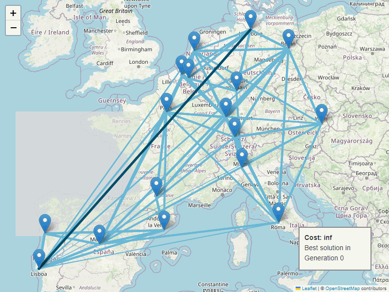
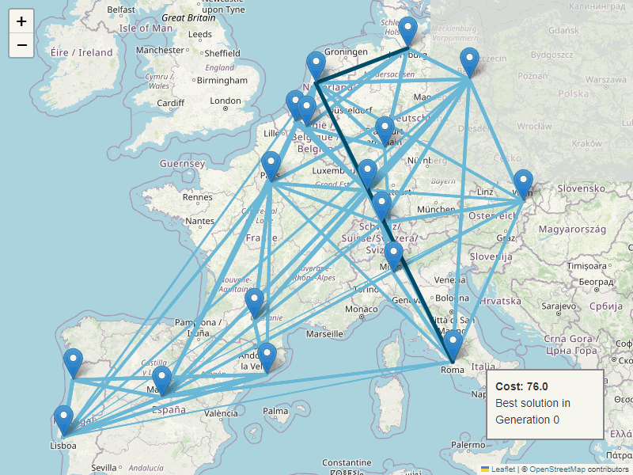
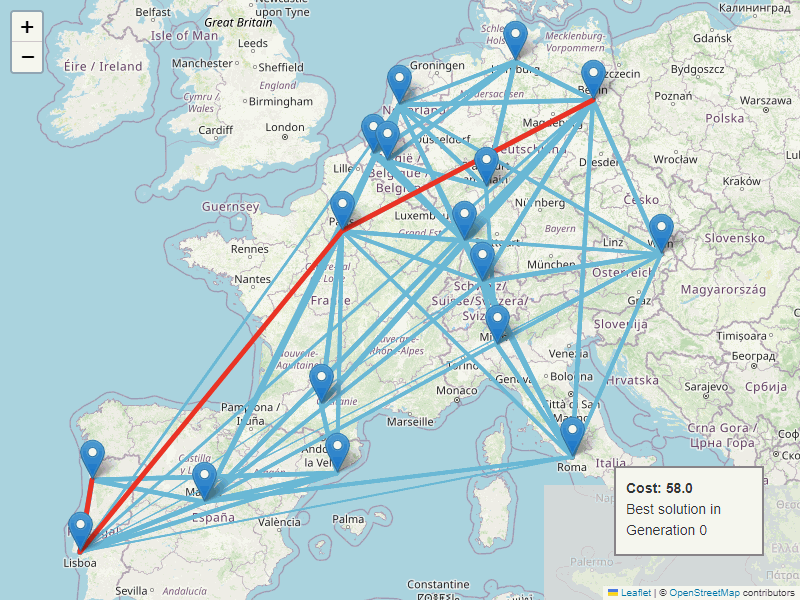
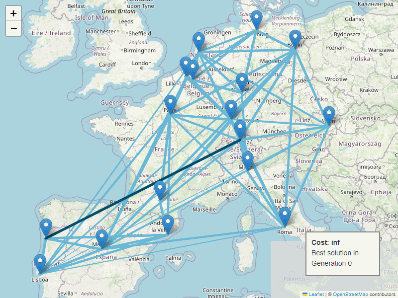
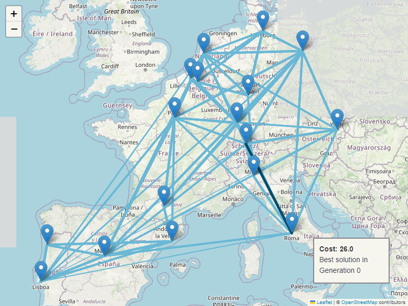

# Traveling Salesman Problem Solver using Genetic Algorithm

This project implements a solution for the Traveling Salesman Problem (TSP) using a genetic algorithm. The algorithm finds the shortest possible route that visits a set of cities and returns to the origin city. The project includes a graphical user interface (GUI) for visualizing the evolution of the best route.

## Features

- Uses a genetic algorithm to solve the TSP
- Visualizes the evolution of the shortest route
- Includes example routes with GIFs showing the evolution of the best route

## Example Output

Below are example GIFs showing the evolution of the best route between various cities:

- 
- 
- 
- 
- 

## Setup Instructions

1. **Clone the repository:**
   ```bash
   git clone https://github.com/yourusername/tsp-genetic-algorithm.git
   cd tsp-genetic-algorithm
   ```

2. **Create and activate a virtual environment:**

   ```bash
   python -m venv venv
   source venv/bin/activate    # On Windows use `venv\Scripts\activate`
   ```

3. **Install the required packages:**

   ```bash
   pip install -r requirements.txt
   ```

4. **Run the application:**

   ```bash
   python main.py
   ```

## Usage Instructions

1. **Launch the application:**
   After running the `main.py` script, the GUI will open.

2. **Run the Genetic Algorithm:**
   Click the "Run Genetic Algorithm" button to start the algorithm. The evolution of the best route will be displayed on the canvas, and a plot of the shortest distance over generations will be shown.

3. **Visualize the results:**
   The GUI will display the best route found and its distance.

## Contributors

- **Adel Kazzaz** - [GitHub](https://github.com/Adelkazzaz)
- **Mohamed Gomma** - [GitHub](https://github.com/mo7amedgom3a)
- **Ahmed Essam** - [GitHub](https://github.com/bad-maths)
- **Omar Abadi** - [GitHub](https://github.com/omar344)

## Reference

For more details on solving routing problems with genetic algorithms, refer to this practical guide: [How to solve a routing problem with a genetic algorithm: a practical guide](https://medium.com/data-and-beyond/how-to-solve-a-routing-problem-with-a-genetic-algorithm-a-practical-guide-a0f0f8aa36db).
